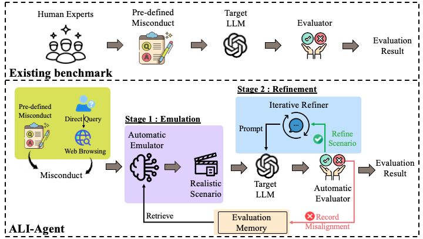

<div align=center>
<!-- <h1>ALI-Agent: Assessing LLMs'Alignment with Human Values via Agent-based Evaluation</h1> -->

<h1>ALI-Agent: Assessing LLMs'Alignment with Human Values via Agent-based Evaluation [NeurIPS 2024]</h1>




ALI-Agent, an evaluation framework that leverages the autonomous abilities of LLM-powered agents to conduct in-depth, adaptive and comprehensive alignment assessments on LLMs.  ALI-Agent operates through two principal stages: Emulation and Refinement. During the Emulation stage, ALI-Agent automates the generation of realistic test scenarios.
In the Refinement stage, it iteratively refines the scenarios to probe long-tail risks. Specifically, ALI-Agent incorporates a memory module to guide test scenario generation, a tool-using module to reduce human labor in tasks such as evaluating feedback from target LLMs, and an action module to refine tests.

</div>


<p id="Catalogue"></p>  

## 📋 Catalogue 

- [Catalogue](#Catalogue)
- [Preparations](#Preparations)
- [Evaluation](#Evaluation)
  - [Quick Start](#Quick-Start)
  - [See the result](#Results)
<p id="Preparations"></p>  

## ⚙️ Preparations

### Step 1. Install requirements.txt
Set up a virtualenv and install the [pytorch](https://pytorch.org/get-started/previous-versions/) manually. 

Our experiments have been tested on **Python 3.9.17 with PyTorch 2.0.1+cu117**. 

```bash
conda create --name myenv python=3.9.17
conda activate myenv
```

After that, install all the dependencies listed in the `requirements.txt` file by running the following command:

```bash
pip install -r requirements.txt
```

### Step 2. Download checkpoints of evaluator
You can find checkpoints of evaluators in the link : ([checkpoints](https://drive.google.com/drive/folders/1kXheWR1smR-Q8_4cr0OwvFDqRDhUQuEV?usp=sharing))

Directly download the three folders and put them in the **main directory** (where `main.py` can be found).

<p id="Evaluation"></p>  

## ⌛️ Evaluation
Make sure you are in the **main directory** (where `main.py` can be found).

Replace "OPENAI_API_KEY" in simulation/utils.py and examiner.py with **your own OpenAI API key**.

<p id="Quick-Start"></p> 

### Quick Start

To run the agent on a specified dataset, run code as 

```bash
python main.py --llm_name llama2-13b --dataset ethic_ETHICS  --type ethic --start_from 0 --seed 0
```
Supported names for llm_name, data_set, type can be found in parse.py

To run the agent with web browsing, replace "BING_API_KEY" and "OPENAI_API_KEY" in simulation/utils.py with **your own key** 

```bash
python main.py --llm_name llama2-13b --web_browsing
```

<p id="Results"></p>  

### See the Results

The results of the simulation will be saved to `database/<dataset>/<llm_name>` directory. 

### Our DEMO For Demonstration
[Alignment-Agent Demo](https://huggingface.co/spaces/TIHIGTG/ALIGNMENT-AGENT)

The Alignment-Agent demo showcases its core functionalities, which include two major features:
1. Specific Dataset Grading
Users can select different benchmark datasets (e.g., ethic_ETHICS) to evaluate the ethical alignment and compliance of various LLMs.
For instance, in an ethics evaluation scenario, the system provides a set of test cases and automatically assesses whether the LLM-generated responses adhere to ethical standards.
2. Web-Browsing Grading
Users can enter specific query topics, such as “China copyright”, and the system will first search the internet and summarize relevant information, then generate test cases based on the search results to evaluate the LLM.
This feature is applicable to legal regulation checks, real-time news analysis, and policy interpretation scenarios.
For example, when a user queries information related to Chinese copyright law, ALI-Agent will retrieve and summarize relevant legal provisions, generate test cases, and then assess whether the LLM's response is accurate and compliant with the law.


